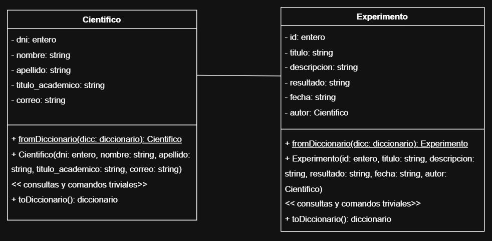

# API for Experiment Management

## 🚀 Description
This project is a REST API built with Flask that allows managing scientists and their experiments.

It was designed applying layered architecture concepts (routes, repositories, entities) and uses JSON files as data persistence.

---

## 🧠 Features

- CRUD for scientists
- CRUD for experiments
- Relationship between scientists and experiments
- Data persistence using JSON files
- Organized architecture (routes, repositories, entities)

---

## 🛠 Technologies

- Python
- Flask
- JSON

---

## 📂 Project Structure

- `rutas/` → API endpoints
- `modelos/entidades/` → domain models
- `modelos/repositorios/` → data access layer
- `datos/` → JSON storage
- `app.py` → main application

---

## 📊 System Design



---

## ⚙️ How to Run

1. Clone the repository:
```bash
git clone https://github.com/JanoNahuelSantos/api-experimentos-flask.git
